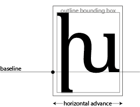
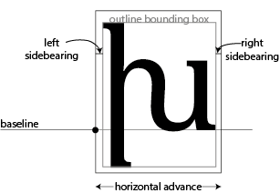
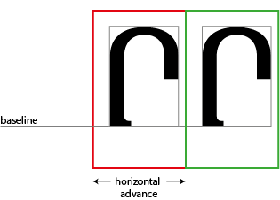

## Characters and glyphs

A typical font contains a few letters; it probably also contains some numbers, and a bunch of symbols, and maybe some other stuff too. But when we talk about what's in a font, it's a bit cumbersome to talk about "letters and numbers and symbols and other stuff." As it happens, we need two specific terms to denote "letters and numbers and symbols and other stuff."

The first term is a term for the things that you design in a font - they are *glyphs*. Some of the glyphs in font are not thinks that you may think need to be designed: the space between words is a glyph, and some fonts have a variety of different space glyphs. Font designers still need to determine how wide those spaces are, and so there is a need for space glyphs to be defined.

Glyphs are the things that you draw and design in your font editor - a glyph is a specific design. My glyph for the letter "a" will be different to your glyph for the letter "a". But in a sense they're both the letter "a". So we are back to needing a term for the generic version of any letter or number or symbol or other stuff: and that term is a *character*. "a" and `a` and *a* and **a** are all different glyphs, but the same character: behind all of the different designs is the same Platonic ideal of an "a". So even though your "a" and my "a" are different, they are both the character "a"; this is something that we will look at again when it comes to the chapter on Unicode, which is a *character set*.

## Dimensions, sidebearings and kerns

As mentioned above, part of the design for a font is deciding how wide, how tall, how deep each glyph is going to be, how much space they should have around them, and so on. The dimensions of a glyph have their own set of terminology, which we'll look at now.

### Units

### Advance widths

Let's first assume that we're designing a horizontal font; in that case, one of the most important dimensions of each glyph is how wide it is - not just the black part of the glyph, but also including the space around it. You will often hear this referred to as the *advance width*, or the *horizontal advance*. This is because most layout systems, working on the typographic model we saw at the beginning of this book, keep track of the X and Y co-ordinates of where they are going to write glyphs to the screen or page; after each glyph, the writing position advances. For a horizontal font, a variable within the layout system (sometimes called the *cursor*) advances along the X dimension, and the amount that the cursor advances is... the horizontal advance.

Glyphs in horizontal fonts are assembled along a horizontal baseline, and the horizontal advance tells the layout system how far along the baseline to advance. In this glyph, (a rather beautiful Armenian letter xeh) the horizontal advance is 1838 units. The layout system will draw this glyph by aligning the dot representing the *origin* of the glyph at the current cursor position, inking in all the black parts and then incrementing X coordinate of the cursor by 1838 units.

Note that the horizontal advance is normally wider than the extremes of the outlines of the glyph itself:

The rectangle containing all the "black parts" of the glyph, which is sometimes called the *ink rectangle* or the *outline bounding box*. Because  most scripts need a little space around each glyph to allow for the reader to easily distinguish them from the glyphs around them, the horizontal advance is usually wider than the outline bounding box. The space between the outline bounding box and the glyph's bounding box is called its sidebearings:

However, in some cases, the ink rectangle will poke out of the side of the horizontal advance; in other words, the sidebearings are negative:

In metal type, having bits of metal poking out of the normal boundaries of the type block was called a *kern*. You can see kerns at the top and bottom of this italic letter "f".

In digital type, however, the word "kern" means something completely different...

### Kerns

As we have mentioned, a layout system will draw a glyph, move the cursor horizontally the distance of the horizontal advance, and draw the next glyph at the new cursor position.

However, to avoid spacing inconsistencies between differing glyph shapes (particularly between a straight edge and a round) and to make the type fit more comfortably, the designer of a digital font can specify that the layout of particular pairs of glyphs should be adjusted.

In this case, the cursor goes *backwards* along the X dimension by 140 units, so that the backside of the ja is parked more comfortably into the opening of the reh. This is a negative kern, but equally a designer can open up more space between a pair of characters by specifying a positive kern value. We will see how kerns are specified in the next two chapters.

### Heights

But first, let's think a little bit about the different measurements of height used in a glyph. Again, we're going to be assuming that we are designing for a horizontal writing system.

The first height to think about is the *baseline*. We have mentioned this already, as the imaginary line on which the glyphs are assembled. In a sense, it's not really a height - in terms of a co-ordinate grid, this is the origin; the y co-ordinate is zero. This doesn't necessarily mean that the "black part" of the glyph starts at the baseline. Some glyphs, such as this plus sign, have the black parts floating above the baseline:

In this case, the baseline is coordinate zero; the glyph begins 104 units above the baseline. But the plus sign needs to be placed above the baseline, and having a baseline as the origin tells us how far above it needs to be placed.

XXX x-height, cap height, ascender, descender

In scripts such as Latin, glyphs are arranged according to their baselines; others, particularly Indic scripts like Devanagari, arrange glyphs along other lines, the so-called "headline":

For the purposes of font technology, this headline doesn't really exist. OpenType is based on the Latin model of arranging glyphs along the baseline, and so even in a script with a headline, the font needs to be designed with the baseline in mind. XXX more here.

### Vertical advance

## Bézier curves

## Font formats
## Editing tools