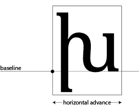

## Characters and glyphs

A typical font contains a few letters; it probably also contains some numbers, and a bunch of symbols, and maybe some other stuff too. But when we talk about what's in a font, it's a bit cumbersome to talk about "letters and numbers and symbols and other stuff." As it happens, we need two specific terms to denote "letters and numbers and symbols and other stuff."

The first term is a term for the things that you design in a font - they are *glyphs*. Some of the glyphs in font are not thinks that you may think need to be designed: the space between words is a glyph, and some fonts have a variety of different space glyphs. Font designers still need to determine how wide those spaces are, and so there is a need for space glyphs to be defined.

Glyphs are the things that you draw and design in your font editor - a glyph is a specific design. My glyph for the letter "a" will be different to your glyph for the letter "a". But in a sense they're both the letter "a". So we are back to needing a term for the generic version of any letter or number or symbol or other stuff: and that term is a *character*. "a" and `a` and *a* and **a** are all different glyphs, but the same character: behind all of the different designs is the same Platonic ideal of an "a". So even though your "a" and my "a" are different, they are both the character "a"; this is something that we will look at again when it comes to the chapter on Unicode, which is a *character set*.

## Dimensions, sidebearings and kerns

As mentioned above, part of the design for a font is deciding how wide, how tall, how deep each glyph is going to be, how much space they should have around them, and so on. The dimensions of a glyph have their own set of terminology, which we'll look at now:

### Advance widths

Let's first assume that we're designing a horizontal font; in that case, one of the most important dimensions of each glyph is how wide it is - not just the black part of the glyph, but also including the space around it. You will often hear this referred to as the *advance width*, or the *horizontal advance*. This is because most layout systems, working on the typographic model we saw at the beginning of this book, keep track of the X and Y co-ordinates of where they are going to write glyphs to the screen or page; after each glyph, the writing position advances. For a horizontal font, it advances along the X dimension, and the amount that it advances is... the horizontal advance.

Glyphs in horizontal fonts are assembled along a horizontal baseline, and the horizontal advance tells the layout system how far along the baseline to advance. Note that this is normally wider than the extremes of the outlines of the glyph itself:

The rectangle containing all the "black parts" of the glyph, which is sometimes called the *ink rectangle* or the *outline bounding box*. Because  most scripts need a little space around each glyph to allow for the reader to easily distinguish them from the glyphs around them

However, in some cases, the ink rectangle will poke out of the side of the horizontal advance:

When we talk about the "width" of a glyph, we are often referring to the width of the black parts, the width of the bounding box; the white and black parts together are the horizontal advance.

## Bézier curves
## Font formats
## Editing tools