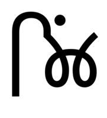
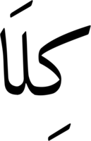
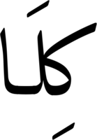
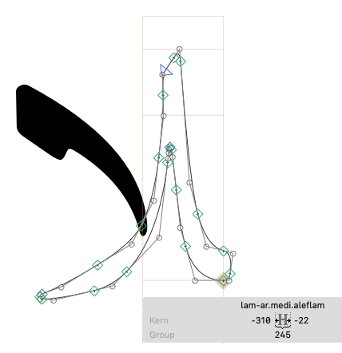
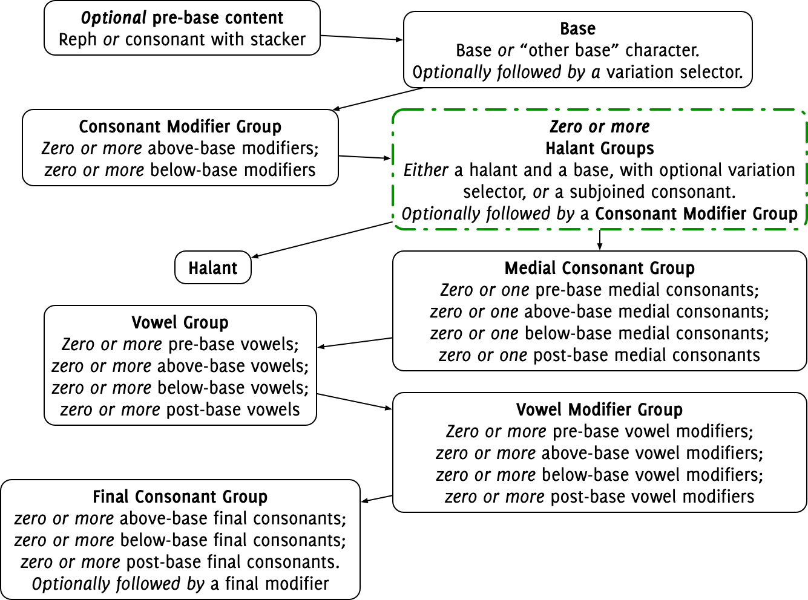
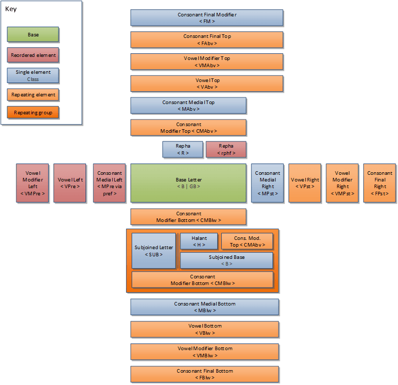
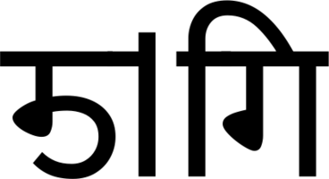

* TOC
{:toc}

In the last chapter, we looked at OpenType features from the perspective of technology: what cool things can we make the font do? In this chapter, however, we're going to look from the perspective of language: how do we make the font support the kind of language features we need? We'll be putting together the substitution and positioning lookups from OpenType Layout that we learnt about in the previous chapter, and using them to create fonts which behave correctly and beautifully for the needs of different scripts and language systems.

## Script and language handling

OpenType fonts can support special handling for multiple different scripts and for multiple different languages within the same font. You can, for example, substitute generic glyph forms for localised forms which are more appropriate in certain linguistic contexts: for example, the Serbian form of the letter be (б) is expected to look different from the Russian form. Both forms can be stored in the same font, and the choice of appropriate glyph made on the basis of the language of the text.

How does this work? The shaper is told, by the layout application, what language and script are being used by the input run of text. (It may also try guessing the script based on the Unicode characters in use.) The script and language are described using four-character codes called "tags"; for example, the script tag for Malayalam is `mlm2`. You can find the list of [script tags](https://docs.microsoft.com/en-gb/typography/opentype/spec/scripttags) and [language tags](https://docs.microsoft.com/en-gb/typography/opentype/spec/languagetags) in the OpenType specification.

To find the appropriate set of features, we take the language and script of the input, and see if there is a set of features defined for that language/script combination. If not, we look at the features defined for the input script and the default language for that script. If that's not defined, then we look at the features defined for the `dflt` script. For example, if you have text that we know to be in Urdu (language tag `URD`) using the Arabic script (script tag `arab`), the shaper will first check if Arabic is included in the script table. If it is, the shaper will then look to see if there are any rules defined for Urdu inside the Arabic script rules; if there are, it will use them. If not, it will use the "default" rules for the Arabic script. If the script table doesn't have any rules for Arabic at all, it'll instead pretend that the script is called `DFLT` and use the feature list defined for that script.

Inside the font, the GSUB and GPOS tables are arranged *first* by script, *then* by language, and finally by feature. But that's a confusing way for font designers to work, so AFDKO syntax allows you to do things the other way around: define your features and write script- and language-specific code inside them. To make this work, however, you have to define your "language systems" at the start of the feature file, like so:

    # languagesystem <script tag> <language tag>;
    languagesystem DFLT dflt;
    languagesystem arab dflt;
    languagesystem arab ARA;
    languagesystem arab URD;
    languagesystem latn dflt;
    languagesystem latn TRK;

This font will have support for Arabic and Urdu, as well as Turkish and "default" (non-language-specific) handling of the Latin script, non-language-specific handling of Arabic *script* (for instance, if the font is used for documents written in Persian; "Arabic" in this case includes Persian letters), and rules that apply generally.

Once we have declared what systems we're going to work with, we can specify that particular lookups apply to particular language systems. So for instance, the Urdu digits four, five and seven have a different form to the Arabic digits. If our font is to support both Arabic and Urdu, we should make sure to substitute the expected forms of the digits when the input text is in Urdu.

We'll do this using a `locl` (localisation) feature which only applies in the case of Urdu:

    feature locl {
        script arab;
        language URD;
        # All rules here apply to Urdu until the next script/language
        sub four-ar by four-ar.urd;
        sub five-ar by five-ar.urd;
        sub seven-ar by seven-ar.urd;
    } locl;

Any rules which appear *before* the first `script` keyword in a setting are considered "default rules" which apply to all scripts and languages. If you want to specify that they should *not* appear for a particular language environment, you need to use the declaration `exclude_dflt` like so:

    feature liga {
        script latn;
        sub f i by fi; # All Latin-based languages get the fi ligature.

        language TRK exclude_dflt; # Except Turkish. Turkish doesn't.
    } locl;

You may also see `include_dflt` in other people's feature files. The default rules are included by, uh, default, so this doesn't actually do anything, but making that explicit can be useful documentation to help you figure out what rules are being applied.

## Features in Practice

Up to this point, I have very confidently told you which features you need to use to achieve certain goals - for example, I said things like "We'll put a contextual rule in the `akhn` feature to make the Kssa conjunct." But when it comes to creating your own fonts, you're going to have to make decisions yourself about where to place your rules and lookups and what features you need to implement. Obviously a good guideline is to look around and copy what other people have done; the growing number of libre fonts on GitHub make it a very helpful source of examples for those learning to program fonts.

But while copying others is a good way to get started, it's also helpful to reason for oneself about what your font ought to do. There are two parts to being able to do this. The first is a general understanding of the OpenType Layout process and how the shaper operates, and by now you should have some awareness of this. The second is a careful look at the [feature tags list](https://docs.microsoft.com/en-us/typography/opentype/spec/featuretags) of the OpenType specification to see if any of them seem to fit what we're doing.

> Don't get *too* stressed out about choosing the right feature for your rules. If you put the rule in a strange feature but your font behaves in the way that you want it to, that's good enough; there is no OpenType Police who will tell you off for violating the specification. Heck, you can put substitution rules in the `kern` feature if you like, and people might look at you funny but it'll probably work fine. The only time this gets critical is when we are talking about (a) features which are selected by the user interface of the application doing the layout (for example, the `smcp` feature is usually turned on when the user asks for small caps, and it would be bizarre - and arguably *wrong* - if this also turned on additional ligatures), and (b) more complex fonts with a large number of rules which need to be processed in a specific order. Getting things in the right place in the processing chain will increase the chances of your font behaving in the way you expect it to, and, more importantly, will reduce the chances of features interacting with each other in unexpected ways.

Let's suppose we are implementing a font for the Takri script of north-west India. There's no Script Development Standard for Takri, so we're on our own. We've designed our glyphs, but we've found a problem. When a consonant has a i-matra and an anusvara, we'd like to move the anusvara closer to the matra. So instead of:

we want to see:

We've designed a new glyph `iMatra.anusvara` which contains both the matra and the correctly-positioned anusvara, and we've written a chained contextual substitution rule:

    lookup iMatraAnusVara {
        sub iMatra by iMatra.anusvara;
        sub anusvara by emptyGlyph;
    }

    sub iMatra' lookup iMatraAnusVara @consonant' anusvara' lookup iMatraAnusVara;

This replaces the matra with our matra-plus-anusvara form, and replaces the old anusvara with an empty glyph. Nice. But what feature does it belong in?

First, we decide what broad category this rule should belong to. Are we rewriting the mapping between characters and glyphs? Not really. So this doesn't go in the initial "pre-shaping" feature collection. It's something that should go towards the end of the processing chain. But it's also a substitution rule rather than a positioning rule, so it should go in the substitution part of the processing chain. It's somewhere in the middle.

Second, we ask ourselves if this is something that we want the user to control or something we want to require. We'd rather it was something that was on by default. So we look through the collection of features that shapers execute by default, and go through their descriptions in the [feature tags](https://docs.microsoft.com/en-us/typography/opentype/spec/featuretags) part of the OpenType spec.

For example, we could make it a required ligature, but we're not exactly "replacing a sequence of glyphs with a single glyph which is preferred for typographic purposes." `dist` might be an option, but that's usually executed at the positioning stage. What about `abvs`, which "substitutes a ligature for a base glyph and mark that's above it"? This feature should be on by default, and is required for Indic scripts; it's normally executed near the start of the substitution phase, after those features which rewrite the input stream. This sounds like it will do the job, so we'll put it there.

Once again, this is not an exact science, and unless you are building up extremely complex fonts, it isn't going to cause you too many problems. So try to reason about what your features are doing, but feel free to copy others, and don't worry too much about it.

Now let's look at how to implement some specific features, starting with a few simple ones to get us started, and then getting to the more tricky stuff later.

## Language-specific substitutes

We've already mentioned the Serbian form of the letter be (б), which should appear different to the Russian Cyrillic version. This is one example of a family of *language-specific substitutes*, which we can handle more or less in the same way.

First, we design our two glyphs, the Russian be (let's call the glyph `be-cy`) and the Serbian variant, which we'll call `be-cy.SRB`. We want a feature which is on by default, occurs early in the process, is pre-shaping (in that it rewrites the input glyph stream) and which substitutes localized forms - this is precisely what the `locl` feature was designed for. We look up the script tag for Cyrillic (`cyrl`) and the language tag for Serbian (`SRB`), and we create a rule that applies only when the input is tagged as being in the Serbian language. We want to do a one-to-one substitution - any Cyrillic be gets swapped out for a Serbian one - so we create a single substitution rule.

    feature locl {
        script cyrl;
        language SRB;
        sub be-cy by be-cy.SRB;
    } locl;

Job done.

We can apply the same kind of substitution not just to base characters but also to marks and combining characters, although we need a little thought. In Polish, there's an accent called a *kreska* which looks like an acute accent from other Latin scripts - and in fact, is expressed in Unicode as an acute accent - but is somewhat more upright and positioned to the right of the glyph. How do we create a font which distinguishes between the Western European acute accent and the Polish kreska, even though the Unicode characters are the same?

First, we should note that the Polish accent appears on some letters we may not have planned for: c, n, s and z - then again, we should also be aware that these letters also get an *acute* accent in other writing systems: Yoruba, Khmer, and Sanskrit transliteration amongst others. So we can't just rely on having the Polish forms for these. We need - as with the vowels - to create two separate versions: one with the Western European acute, and one with *kreska*. We look at [Adam Twardoch's web site](http://www.twardoch.com/download/polishhowto/kreska.html) to help get the design of our Polish accents right, and we should now end up with two sets of glyphs: `aacute`, `cacute`, ... and `aacute.PLK`, `cacute.PLK` and so on.

Now we know what we're doing: we use the `locl` feature as before to substitute in these glyphs when the input text is in Polish:

    feature locl {
        script latn;
        language PLK;
        sub [aacute cacute ...] by [aacute.PLK cacute.PLK ...];
    } locl;

> This general pattern - language-specific substitution rules in the `locl` feature - can be used for a large number of localisation customizations, particularly those based on the Latin script (simply because they tend to be one-to-one glyph replacements.) Further examples of the pattern include Navajo forms of the ogonek accent, and choosing between variants of the letter U+014A LATIN CAPITAL LETTER ENG (Ŋ) - "N-form" variants in the case of Sami languages and "n-form" variants for African ones.

### A detour about diacritics

We've looked at the mark-to-base positioning and composition/decomposition substitutions in previous chapters. Why, then, do we need to design separate glyphs for `cacute` and `cacute.PLK` - can't we just design separate *accents* and have the OpenType system tie them together for us? In fact, why do we even need to include a `cacute` in our font *at all*? Can't we just have the font automatically compose the glyph out of the c base glyph and the acute mark, and automatically position it for us? Hey, why can't we do that for *all* our diacritic characters? As with many things in life, the answer is: sure, you *can*, but that doesn't mean you *should*.

There are a few reasons why it's best to design and include precomposed forms of all the accented glyphs you're going to support, rather than rely on automatic composition. For one thing, there's kerning: it's much easier to test and edit the kerning for "Tå" in your font editor than adding tricky kern triplets in OpenType feature code.

Another problem is that some software (notably Adobe InDesign) doesn't support it, and other software doesn't support it in reliable ways. This is an important area to understand because it highlights the interplay between *OpenType*'s understanding of characters and glyphs and *Unicode*'s understanding of characters and glyphs.

Remember how we talked about [Unicode normalization and decomposition](unicode.html#normalization-and-decomposition) in chapter 3, and how you can decompose a character like é (U+00E9 LATIN SMALL LETTER E WITH ACUTE) into two characters, U+0065 LATIN SMALL LETTER E and U+0301 COMBINING ACUTE ACCENT? That sounds very similar to the idea of having an "eacute" glyph which is made up of an "e" glyph and an "acutecomb" glyph. Similar... but unfortunately different.

As it happens, if your font provides a "e" and a "acutecomb" glyph but *not* a precomposed "eacute", then some text layout systems will *only* render an e-acute if the input text is decomposed to U+0065 U+0301 (which is exceptionally rare) and will use a fallback font to display the precomposed form U+00E9. Others will automatically decompose a U+00E9 in the input stream to U+0065 U+0301 and display the two glyphs correctly. Some systems will correctly substitute a precomposed glyph for its decomposition specified using the `ccmp` feature, but then will fail to position the marks properly in the `mark` feature.

But having a precomposed glyph in the font will always work, both for composed Unicode characters like U+00E9 *and* for its decompositions, so that's why having the font contain all the glyphs you are likely to support is a better way to go.

## The letter "i"

The Latin letter "i" (and sometimes "j") turns out to need special handling. For one thing, in Turkish, as we've mentioned before, lower case "i" uppercases to "İ".

Unicode knows this, so when people ask their word processors to turn their text into upper case, the word processor replaces the Latin letter "i" with the Turkish capital version, LATIN CAPITAL LETTER I WITH DOT ABOVE U+0130. Fine. Your font then gets the right character to render. However, what about the case (ha, ha) when you ask the word processor for small capitals? Small capitals are a typographic refinement, which changes the *presentation* of the characters, *but not the characters themselves*. Your font will still be asked to process a lower case Latin letter i, but to present it as a small caps version - which means you do not get the advantage of the application doing the Unicode case mapping for you. You have to do it yourself.

> In fact, *any* time the font is asked to make presentational changes to glyphs, you need to implement any character-based special casing by hand. What we say here for small-caps Turkish i is also valid for German sharp-s and so on.

Additionally, you may want to inhibit Turkish "i" from forming ligatures such as "fi" and "ffi", while allowing ligatures in other Latin-based languages.

We're going to look at *two* ways to achieve these things. I'm giving you two ways because I don't want you just to apply it as a recipe for this particular situation, but hopefully inspire you to think about how to use similar techniques to solve your own problems.

Here's the first way to do it, in which we'll deal with the problems one at a time. We make a special rule in the `smcp` feature for dealing with Turkish:

    feature smcp {
        sub i by i.sc; # Amongst everything else.
        script latn;
        language TRK;
        sub i by i.sc.TRK;
    }

Oops, this doesn't work. Can you see why not? Remember that the language-specific part of a feature includes all the default rules. The shaper sees a "i" and the `smcp` feature, and runs through all the rules one at a time. The default rules are processed *first*, so that "i" gets substituted for "i.sc". Finally the shaper comes to the Turkish-specific rule, but by this point any "i" glyphs have already been turned into something else, so it does not match.

How about this?

    feature smcp {
        sub i by i.sc; # Amongst everything else.
        script latn;
        language TRK;
        sub i.sc by i.sc.TRK;
    }

Now the shaper gets two bites at the cherry: it first turns "i" into "i.sc", and then additionally in Turkish contexts the "i.sc" is turned into "i.sc.TRK". This works, but it's ugly.

The ligature situation is taken care of using `exclude_dflt`:

    feature liga {
        sub f i by f_i;
        script latn;
        language TRK exclude_dft;
    }

Now there are no ligature rules for Turkish, because we have explicitly asked not to include the default rules.

Here's another, and perhaps neater, way to achieve the same effect. In this method, we'll create a separate "Turkish i" glyph, "i.TRK", which is visually identical to the standard Latin "i". Now in the case of Turkish, we will substitute any Latin "i"s with our "i.TRK" in a `locl` feature:

    feature locl {
      script latn;
      language TRK exclude_dflt;
      sub i by i.TRK;
    } locl;

What does that achieve? Well, the problem with ligatures is taken care of straight away, without any additional code. We create our `liga` feature as normal:

    feature liga {
        sub f i by f_i;
    }

But we don't need to do anything specific for Turkish, because in the Turkish case, the shaper will see "f i.TRK" and the rule will not match. The small caps case is easier too:

    feature smcp {
        sub i by i.sc; # Amongst everything else.
        sub i.TRK by i.sc.TRK;
    }

This has "cost" us an extra glyph in the font which is a duplicate of another glyph, but has made the feature coding much simpler. Both ways work - choose whichever best fits your mental model of how the process should operate.

## Arabic, Urdu and Sindhi

In the various languages which make use of the Arabic script, there are sometimes locally expected variations of the glyph set - for instance, we mentioned the variant numbers four, five and seven in Urdu. The expected form of the letter heh differs in Urdu, Sindhi, Pakari and Kurdish. In Persian, a language-specific form of kaf (ک, U+06A9 ARABIC LETTER KEHEH) is preferred over the usual form of kaf (ك, U+0643 ARABIC LETTER KAF); however, Persian documents may encode kaf with using U+0643, so fonts supporting Persian should substitute kaf with the "keheh" form. All of these substitutions can be made using the language-sepcific `locl` feature trick we saw above.

> "How do I know all this stuff?" Well, part of good type design is doing your research: looking into exemplars and documents showing local expectations, testing your designs with native readers, and so on. But there's also a growing number of people collating and documenting this kind of language-specific information. As we've mentioned, the Unicode Standard, and the original script encoding proposals for Unicode, give some background information on how the script works. I've also added a list of resources to the end of this chapter which collects some of the best sources for type design information.

Arabic additionally has a number of design styles representing its calligraphic origins. These different styles require a greater or lesser degree of calligraphic complexity, nastaleeq being the most complex. The font designer's challenge is to provide an adequate number of contextual substitutions to create a natural and pleasing effect. As you consider the appropriate ways of writing different pairs of letters together, the more ligature forms you envision for your font, the more complex you can expect the feature processing to be.

One important trick in Arabic feature programming is to make heavy use of chaining contextual substitutions instead of ligatures. Let's consider the word كِلَا (kilā, "both"). A simple rendering of this word, without any calligraphic substitutions, might look like this: (Glyphs from Khaled Hosny's *Amiri*.)

Running `hb-shape --features='-calt' Amiri-Regular.ttf كِلَا` confirms that no contextual shaping beyond the conversion into initial, medial and final forms is going on:

    [uni0627.fina=4+229|uni064E=2@-208,0+0|uni0644.medi=2+197|uni0650=0@8,0+0|uni0643.init=0+659]

Obviously this is unaccepable. There are two ways we can improve this rendering. The first is the obvious substitution of the final lam-alif with the lam-alif ligature, like so:

But the second, looking at the start of the word, is to form a kaf-lam ligature:

Ah, but... what if we want to do both? If we use ligature substitutions like so:

    feature calt {
        lookupflag IgnoreMarks;
        sub lam-ar.medi kaf-ar.init by kaf-lam.init; # Rule 1
        sub alef-ar.fina lam-ar.medi by lam-alef.fina; # Rule 2
    } calt;

what is going to happen? The shaper will work through the string in visual order (as we mentioned in the previous chapter), seeing the glyphs `alef-ar.fina lam-ar.medi kaf-ar.init`. It sees the first pair of glyphs, and applies Rule 2 above, meaning that the new string is `lam-alef.fina kaf-ar.init`. It tries to match any rule against this new string, but nothing matches.

Let's now rewrite this feature using chained contextual substitutions and glyph classes. Instead of creating a lam-alef ligature and a kaf-lam ligature, we split each ligature into two "marked" glyphs. Let's first do this for the lam-alef ligature. We design two glyphs, `alef-ar.fina.aleflam` and `lam-ar.medi.aleflam`, which look like this:

and then we substitute each glyph by its related "half-ligature":

    lookup AlefLam {
        sub alef-ar.fina by alef-ar.fina.aleflam;
        sub lam-ar.medi by lam-ar.medi.aleflam;
    } AlefLam;

    feature calt {
        lookupflag IgnoreMarks;
        sub alef-ar.fina' lookup AlefLam lam-ar.medi' lookup AlefLam;
    }

Now we declare that `lam-ar.medi.aleflam` is a variant form of medial lam, using a glyph class:

    @lam.medi = [ lam-ar.medi lam-ar.medi.aleflam ... ];

Finally, we create our variant kaf, which we call `kaf-ar.init.lamkaf`, and now we can apply the kaf-lam substitution to anything "lam-like":

    feature calt {
        lookupflag IgnoreMarks;
        sub alef-ar.fina' lookup AlefLam lam-ar.medi' lookup AlefLam; # Rule 1
        sub @lam.medi kaf-ar.init' by kaf-ar.init.lamkaf; # Rule 2
    }

Now when the shaper sees alef lam kaf, what happens? Alef and lam match rule 1, which chains into the "AlefLam" lookup; this converts the first glyph to `alef-ar.fina.aleflam` and the second to `lam-ar.medi.aleflam`. Now our string is `alef-ar.fina.aleflam lam-ar.medi.aleflam kaf-ar.init`. At which point, because `lam-ar.medi.aleflam` is part of the `@lam.medi` glyph class, rule 2 *also* matches, meaning that `kaf-ar.init` gets substituted for `kaf-ar.init.lamkaf`.

It's a little more convoluted, but this way we have a substitution arrangement that works not just by ligating a pair at a time, but which allows us to *continue* transforming glyphs across the string: alef-lam works, as does lam-kaf, but they also both work together.

## Devanagari

Cluster reordering

Reph forms.
See e.g.

https://github.com/itfoundry/hind/blob/master/family.fea

## The Universal Shaping Engine

Do you remember how the script tag for Devanagari is now `dev2` because Microsoft wrote two versions of its Indic shaper and the second one works better? This shows us that there is an awful lot of specialist knowledge that goes on inside the shaping engine. Shaping engines like Harfbuzz and Uniscribe contain code which handle various special cases required by different script systems - syllable reordering in Indic scripts, *jamo* composition in Hangul, presentation forms in Hebrew, adjustment of tone mark placement in Thai, and so on.

Of course, there's a problem with this. If the shaper contains all the knowledge about how to organise a script, that means that when a new script is encoded and fonts are created for it, we need to wait until the shaping engines are updated with new handling code to deal with the new script. Even when the code *is* added to the shaper, fonts won't be properly supported in older versions of the software, and in the case of commercial shaping engines, it may not actually make economic sense for the developer to spend time writing specific shaping code for minority scripts anyway.

After overseeing the development of far more script-specific shapers than one person really should, Andrew Glass of Microsoft wondered whether it would be possible to develop one shaping engine for all of Unicode. A similar endeavour by SIL called Graphite attempts to acts as a universal shaping engine by moving the script-specific logic from the shaper into the font: Graphite "smart fonts" contain a bytecode program which is executed by the shaper in place of the shaper's script-specific knowledge. In Glass' idea of the Universal Shaping Engine, however, the intelligence is neither in the font nor in the shaping engine, but provided by the Unicode Character Database.

Each character that enters the Universal Shaping Engine is looked up in the Unicode Character Database. Based on its Indic Syllabic Category, General Category, and Indic Positional Category entries, is placed into one of twenty-four character classes, further divided into 26 sub-classes. The input characters are then formed into clusters based on these character classes, and features are applied to each cluster in turn.

One problem that the USE attempts to solve is that the order that characters are encoded in Unicode is not the same as the order in which their respective glyphs are meant to be displayed. A USE shaper looks at the character classes of the incoming input and forms them into a cluster by matching the following characteristics:

> If you want a more formal grammar for a USE cluster, you can find one in the Microsoft [script development specs](https://docs.microsoft.com/en-us/typography/script-development/use).

But the USE expects those characters to be formed into a glyph which looks like this:

For instance, in Telugu, we know that the series of characters ఫ్ ట్ వే should be formed into a single cluster (ఫ్ట్వే), because it is made up of a base character ఫ, followed by two halant groups (virama, base consonant), and a final top-positioned vowel. The script development spec mentioned above explained how these categories are derived from the Indic Positional Category and Indic Syllabic Category information in the Unicode Character Database.

This "computational" model of a cluster does not know anything about the linguistic rules used in real-life scripts; you can create valid USE clusters which would be shaped "correctly" according to the script grammar defined in the specification, even though they have no relationship with anything in the actual language. For example, we can imagine a Balinese sequence made up of the following characters:

* ᬳ BALINESE LETTER HA, Base
* ᬴ BALINESE SIGN REREKAN, Consonant modifier above
* Halant group:
    * ᭄ BALINESE ADEG ADEG, Halant
    * ᬗ BALINESE LETTER NGA, Base
    * ᬴ BALINESE SIGN REREKAN, Consonant modifier above
* Halant group:
    * ᭄ BALINESE ADEG ADEG, Halant
    * ᬢ BALINESE LETTER TA, Base
* Vowels:
    * ᬶ BALINESE VOWEL SIGN ULU, Vowel above
    * ᬹ BALINESE VOWEL SIGN SUKU ILUT, Vowel below
    * ᬸ BALINESE VOWEL SIGN SUKU, Vowel below
    * ᬵ BALINESE VOWEL SIGN TEDUNG, Vowel post
* Vowel modifiers:
    * ᬀ BALINESE SIGN ULU RICEM, Vowel modifier above
    * ᬁ BALINESE SIGN ULU CANDRA, Vowel modifier above
    * ᬄ BALINESE SIGN BISAH, Vowel modifier post
* Final consonants:
    * ᬃ BALINESE SIGN SURANG, Consonant final above

It's complete gobbledegook, obviously, but nevertheless it forms a single valid graphemic cluster according to the Universal Shaping Engine, and Harfbuzz (which implements the USE) bravely attempts to shape it:

When USE has identified a cluster according to the rules above, the first set of features are applied - `locl`, `ccmp`, `nukt` and `akhn` in that order; next, the second set of features - `rphf` and `pref` in that order; then the third set of features - `rkrf`, `abvf`, `blwf`, `half`, `pstf`, `vatu` and `cjct` (not *necessarily* in that order).

After these three feature groups are applied, the glyphs are *reordered* so that instead of their logical order (the order that Unicode requires them to be entered in a text) they now represent their visual order (reading from left to right). Rephs are keyed into a text *before* the base character, but are logically *after* it in the glyph stream. So in the Śāradā script used in Kashmir, we can enter 𑇂 (U+111C2 SHARADA SIGN JIHVAMULIYA) 𑆯 (U+111AF SHARADA LETTER SHA), and this is reordered by the shaping engine like so:

        $ hb-shape NotoSansSharada-Regular.ttf '𑇂𑆯'
        [Sha=0+700|Jihvamuliya.ns=0@-680,0+0]

Notice how the Jihvamuliya (reph) has been placed after the base glyph in the glyph stream (even though it's then positioned on top).

Similarly, glyphs representing pre-base characters (specifically pre-base vowels and pre-base vowel modifiers - and glyphs which have been identified with the `pref` feature) are moved to the beginning of the cluster but after the nearest virama to the left. Here we have a base (U+111A8 BHA), a halant (U+111C0 VIRAMA), another base (U+11193 GA), and a pre-base vowel (U+111B4 VOWEL SIGN I).

        $ hb-shape NotoSansSharada-Regular.ttf '𑆨𑇀𑆓𑆴'
        [Bha=0+631|virama=0+250|I=2+224|Ga=2+585]

The i-matra has been correctly moved to before the base GA, even though it appeared after it in the input stream.

## Vertical typesetting

vhea, vmtx, VORG

## Resources

To finish, here is a list of resources which may help you when designing and implementing for global scripts:

* Latin diacritics design:
  - [The Insects Project](http://theinsectsproject.eu) - a downloadable book on issues of Central European diacritic design
  - [Problems of Diacritic Design for Latin script text faces](http://gaultney.org/jvgtype/wp-content/uploads/ProbsOfDiacDesignLowRes.pdf)
  - [Polish diacritics how-to](http://www.twardoch.com/download/polishhowto/index.html) (Adam Twardoch)
  - Filip Blažek's [Diacritics project](http://diacritics.typo.cz)
  - [Context of Diacritics](http://www.urtd.net/x/cod/) analyses diacritics by frequency, combination and language
* Danny Trương's [Vietnamese Typography](https://vietnamesetypography.com)
* Guidance on specific characters:
  - [thorn and eth](https://sites.google.com/view/briem/design) (Gunnlaugur Briem)
  - [Tcomma and Tcedilla](https://typedrawers.com/discussion/318/tcomma-and-tcedilla)
  - [German capital sharp s](https://typography.guru/journal/capital-sharp-s-designs/), and [OpenType feature code to support it](https://medium.com/@typefacts/the-german-capital-letter-eszett-e0936c1388f8)
* Microsoft's script development specifications: [Latin, Cyrillic, Greek](https://docs.microsoft.com/en-gb/typography/script-development/standard); [Arabic](https://docs.microsoft.com/en-gb/typography/script-development/arabic); [Buginese](https://docs.microsoft.com/en-gb/typography/script-development/buginese); [Hangul](https://docs.microsoft.com/en-gb/typography/script-development/hangul); [Hebrew](https://docs.microsoft.com/en-gb/typography/script-development/hebrew); [Bengali](https://docs.microsoft.com/en-gb/typography/script-development/bengali); [Devanagari](https://docs.microsoft.com/en-gb/typography/script-development/devanagari); [Gujarati](https://docs.microsoft.com/en-gb/typography/script-development/gujarati); [Gurmukhi](https://docs.microsoft.com/en-gb/typography/script-development/gurmukhi); [Kannada](https://docs.microsoft.com/en-gb/typography/script-development/kannada); [Malayalam](https://docs.microsoft.com/en-gb/typography/script-development/malayalam); [Oriya](https://docs.microsoft.com/en-gb/typography/script-development/oriya); [Tamil](https://docs.microsoft.com/en-gb/typography/script-development/tamil); [Telugu](https://docs.microsoft.com/en-gb/typography/script-development/telugu); [Javanese](https://docs.microsoft.com/en-gb/typography/script-development/javanese); [Khmer](https://docs.microsoft.com/en-gb/typography/script-development/khmer); [Lao](https://docs.microsoft.com/en-gb/typography/script-development/lao); [Myanmar](https://docs.microsoft.com/en-gb/typography/script-development/myanmar); [Sinhala](https://docs.microsoft.com/en-gb/typography/script-development/sinhala); [Syriac](https://docs.microsoft.com/en-gb/typography/script-development/syriac); [Thaana](https://docs.microsoft.com/en-gb/typography/script-development/thaana); [Thai](https://docs.microsoft.com/en-gb/typography/script-development/thai); [Tibetan](https://docs.microsoft.com/en-gb/typography/script-development/tibetan)
* Arabic resources:
  - Jonathan Kew's [Notes on some Unicode Arabic characters: recommendations for usage](https://scripts.sil.org/cms/scripts/render_download.php?format=file&media_id=arabicletterusagenotes&filename=ArabicLetterUsageNotes.pdf)
  - [Character Requirements for a Nastaliq font](https://scriptsource.org/cms/scripts/page.php?item_id=entry_detail&uid=q5mbdr6h3b)
* Script databases:
  - [Omniglot](https://www.omniglot.com) is an online encyclopedia of scripts and languages.
  - [ScriptSource](https://scriptsource.org/cms/scripts/page.php) is similar, but includes an annotated version of the Unicode Character Database for each codepoint. See, for example, the page about [LATIN SMALL LETTER EZH](https://scriptsource.org/cms/scripts/page.php?item_id=character_detail_use&key=U000292).
  - Eesti Keele Institute [letter database](http://www.eki.ee/letter/) tells you what glyphs you need to support particular languages.

